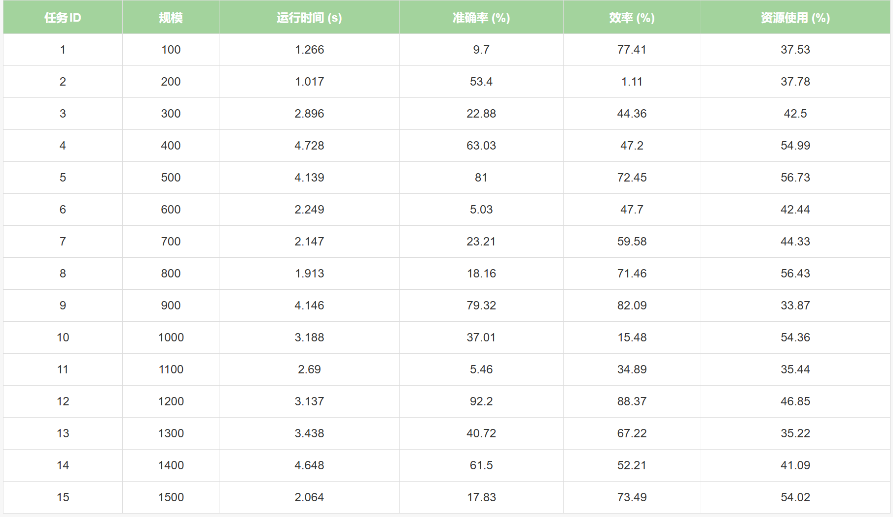
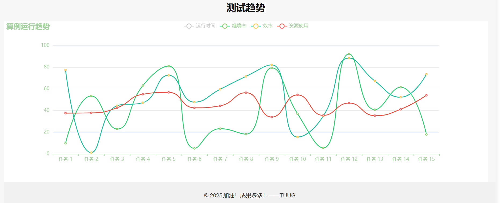

# 优化算例自动测试系统

## 项目简介
本系统是一个专门用于论文算例自动测试的Web应用平台，旨在提供高效、可靠的算例测试环境。系统采用现代化的Web技术栈，为用户提供直观的测试界面和实时的数据分析功能。

## 主要功能
- **自动化测试**：一键启动算例测试，支持批量处理多个测试用例
- **实时监控**：提供测试进度实时显示，直观展示测试执行状态
- **数据可视化**：通过图表展示测试结果趋势，包括运行时间、准确率、效率和资源使用情况
- **结果分析**：自动生成测试报告，支持多维度的数据分析

## 效果展示

## 技术特点
- 前端采用现代化的响应式设计，确保良好的用户体验
- 使用ECharts实现专业的数据可视化展示
- 支持实时数据更新，保证测试结果的及时性
- 采用模块化设计，便于系统扩展和维护

## 系统架构
- 前端：HTML5 + CSS3 + JavaScript (jQuery + ECharts)
- 后端：Python Web框架
- 数据存储：支持多种数据存储方案

## 应用场景
- 学术研究中的算法验证
- 优化算法的性能测试
- 生产系统的效率评估
- 资源利用率的监控分析

## 项目特色
1. **用户友好**：简洁直观的界面设计，操作便捷
2. **实时反馈**：测试过程实时展示，进度一目了然
3. **数据分析**：提供多维度的数据分析和可视化
4. **可扩展性**：支持自定义测试用例和测试参数

## 使用说明
1. 在首页点击"开始测试"按钮启动测试
2. 系统自动执行测试并实时更新进度
3. 测试结果将以表格和图表形式展示
4. 可通过导航栏切换不同功能模块

## 开发作者
- 开发作者：TUUG
- 版本：1.0.0
- 欢迎大家加入到这一项目中，共同完善这一平台

## 联系方式
如有问题或建议，请联系tr666666@qq.com
